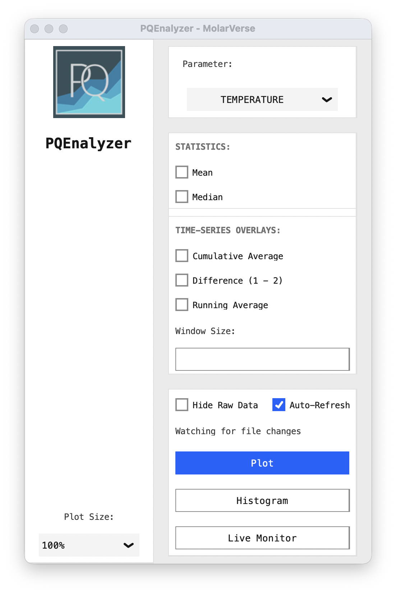

#  PQEnalyzer

Inspect simulation output: time series, distributions and autocorrelation.

**Desktop (Tkinter) is the default.** Choose the interface when launching:

| Interface | Command |
| --- | --- |
| Desktop — default | `pqenalyzer simulation.en` |
| Browser | `pqenalyzer web simulation.en` |




## Open your data

Python 3.10+. Keep each energy file's matching `.info` beside it.

```bash
python3 -m venv .venv
source .venv/bin/activate
python -m pip install PQEnalyzer
```

| Browser action | Control |
| --- | --- |
| Choose a quantity | Dashboard tile or `Ctrl/Cmd+K` |
| Inspect or analyze | Hover the chart; open **Analysis** |
| See the distribution | **Histogram** or `2` |

In the browser, multiple files form **one dataset in command-line order**, across every chart and analysis.
Read the original files directly; no conversion is needed.

[Visual guide](https://molarverse.github.io/PQEnalyzer/getting-started.html) ·
[Methods](https://molarverse.github.io/PQEnalyzer/analysis.html) ·
[Cluster / home VPN](https://molarverse.github.io/PQEnalyzer/remote-access.html)

Parsing uses [PQAnalysis](https://github.com/MolarVerse/PQAnalysis).
