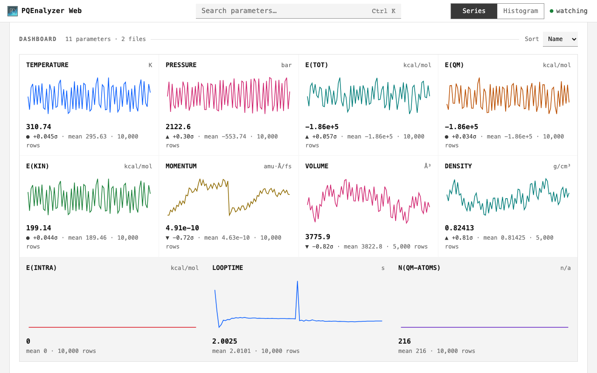
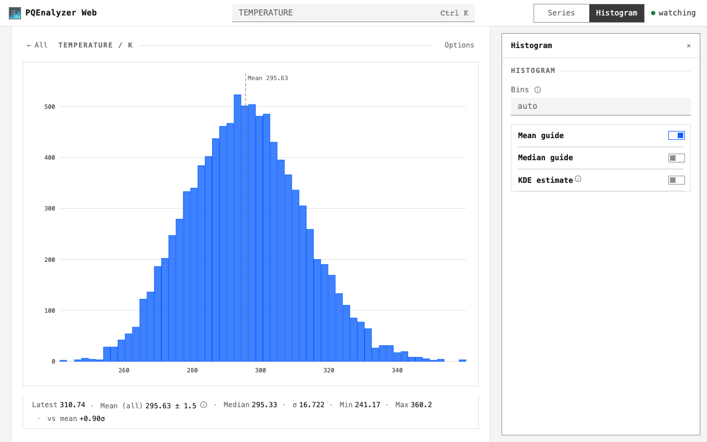

# Use the GUI

## 1. Choose a quantity

Click a dashboard tile, or search with `Ctrl+K` (`Cmd+K` on macOS).



## 2. Inspect the series

Hover for values. Drag to zoom; double-click to reset.
Open **Analysis** to select a mean, average or autocorrelation.


**Mean (all)** includes every finite value. Its `±` is the estimated standard error.
**Autocorrelation** shows the sequence correlated with itself, against lag in samples.
The MSER cut is a proposed transient boundary; summaries still use all data.
[Method definitions](analysis.md).

## 3. Inspect the distribution

Choose **Histogram**. **Options** controls bins, reference lines and KDE.



| Control | Action |
| --- | --- |
| **All** / `Esc` | Return to the dashboard; first `Esc` leaves an active input or panel |
| **Series** / **Histogram**, or `1` / `2` | Change chart type |
| **Analysis** / **Options**, or `o` | Show chart controls |
| Left/Right arrows, `Home`, `End` | Inspect a focused chart without a mouse |
| Watching indicator | Pause or resume file updates |
| Download icon (Series) | Save the chart as PNG |
| `?` | Show all shortcuts |

## Install and open

Python 3.10+. In a new environment:

```bash
python3 -m venv .venv
source .venv/bin/activate
python -m pip install PQEnalyzer
pqenalyzer web simulation.en
```

Keep `simulation.info` beside `simulation.en`. The browser opens at
<http://127.0.0.1:8766>. Multiple files form one dataset in acquisition order:

```bash
pqenalyzer web md-01.en md-02.en
```

Use `--port 8767` for a different port. On a server, add `--no-open` and use
the [SSH / VPN guide](remote-access.md). No file conversion is needed.

## Desktop windows

```bash
pqenalyzer gui simulation.en
```

`Plot`, `Histogram` and `Live Monitor` open separate windows. Double-click a
monitor panel to focus it; `f` fits the grid. Auto-refresh watches the files.
Desktop **Difference** computes file 1 minus file 2 at matching time or step
values, with exactly two files and no interpolation.
