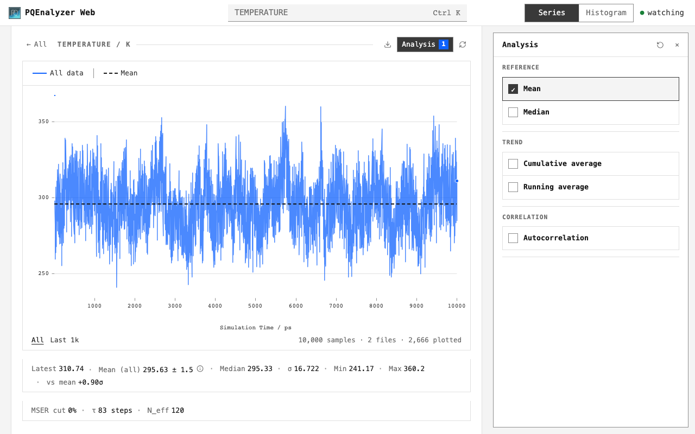

# PQEnalyzer

Inspect simulation output in your browser. All selected files form one ordered dataset.



```bash
python3 -m venv .venv
source .venv/bin/activate
python -m pip install PQEnalyzer
pqenalyzer web simulation.en
```

| Start here | Reference |
| --- | --- |
| [Use the GUI](getting-started.md) | [Charts and uncertainty](analysis.md) |
| [Open files](input.md) | [Formats, units and dataset order](input.md#dataset-conventions) |
| [Connect from a cluster or home VPN](remote-access.md) | [Development](development.md) |

```{toctree}
:hidden:

getting-started
input
analysis
remote-access
development
```
